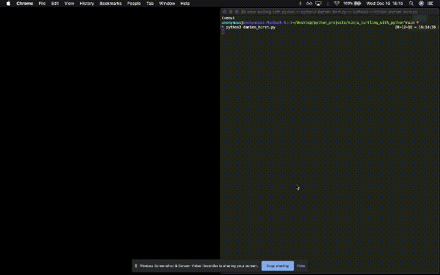
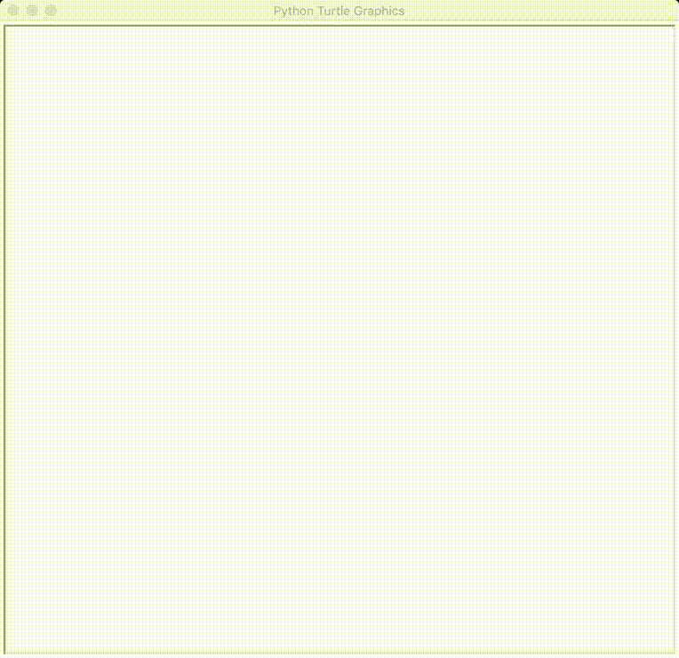

# ninja_turtling_with_python

## In terminal...\
python3 spirograph.py\
- Draw speed [1, 3, 6, 10, 0]:\
- Number of rings [1 to 8]:\
- Circle size [1 to 500]:\
- Pen size [1 to 100]:

## In terminal...\
python3 damien_hirst.py\
- Desired dot size [1 - 100]:

